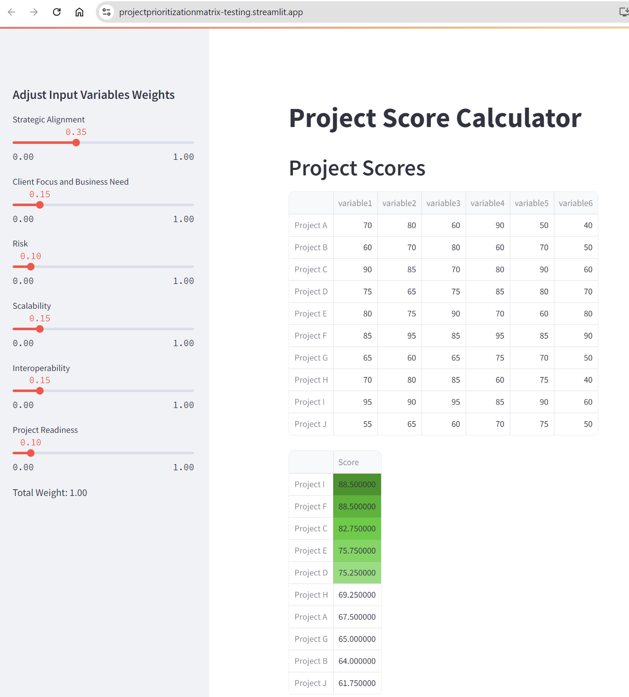
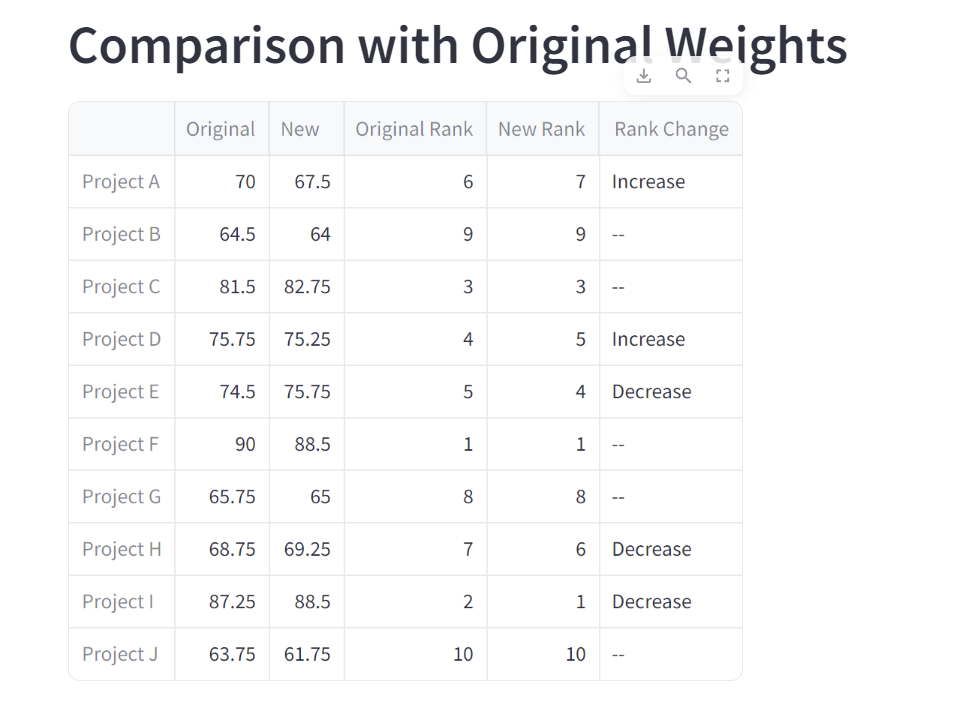

## Project Summary: mainv4.py


### Context
I was in a meeting in which a new prioritization matrix (project ranking) was introduced. I wanted to understand the approach to the relative weights for each input variable. In other words, "How did we arrive at 20% for variable 1?" Subsequently, I was instereted if we could visualize the sensitivty to ranking change if a weight is revised. I was imagining an end-user (a project lead) potentially 'protesting' that their initiative was not at the top of the list. 

The questions didnt generate the discussion I had hoped... so I figured I would try to build it myself. Below is the result. Turns out it may not be directly 'useful' (as there is a version already published a related and influential organization). No matter, it was an interesting academic exercise. 



### Overview
The [`mainv4.py`]script is a Streamlit application designed to calculate and compare project scores based on user-defined weights for various evaluation criteria. The application allows users to adjust the weights of different variables and dynamically see the impact on project rankings.

### Features

1. **Project Definition**: Defines a set of projects and their scores for various evaluation criteria.
2. **Dynamic Weight Adjustment**: Provides sliders for users to adjust the weights of different evaluation criteria.
3. **Score Calculation**: Calculates the total score for each project based on the user-defined weights.
4. **Dynamic Updates**: Automatically updates the project scores and rankings as the weights are adjusted.
5. **Comparison with Original Weights**: Compares the new project scores and rankings with the original scores and rankings.
6. **Conditional Formatting**: Highlights the "New" scores in green if they are greater than the "Original" scores.

### Future:

- [ ] Implement partial derivative to empirically evaluate the sensitvity to changes in variable weights.
- [ ] Connect a project input form / spreadsheet (currently, inputs are hard coded)
- [ ] Setup my nginx server on docker (again) so I can self-host.
- [ ] Add more cool visualizations... 
- [ ] Introduce a 'goal seek' to identify which variables for a given project need to change to increase the ranking of the selected project to be in the "top 5" (the scope of considered projects)

### Code Summary

#### 1. Project Definition

Defines a dictionary of projects with their respective scores for each evaluation criterion.

```python
projects = {
    'Project A': {'variable1': 70, 'variable2': 80, 'variable3': 60, 'variable4': 90, 'variable5': 50, 'variable6': 40},
    'Project B': {'variable1': 60, 'variable2': 70, 'variable3': 80, 'variable4': 60, 'variable5': 70, 'variable6': 50},
    # ... other projects ...
}
```

#### 2. Score Calculation Function

Defines a function to calculate project scores based on input variables and weights.

```python
def calculate_project_scores(projects, input_variables):
    scores = {}
    for project, variables in projects.items():
        score = sum(variables[var] * weight for var, weight in input_variables.items())
        scores[project] = score
    return scores
```

#### 3. Streamlit App Setup

Sets up the Streamlit application with a title and input sliders for adjusting the weights of different evaluation criteria.

```python
st.title("Project Score Calculator")

# Input sliders for weights
st.sidebar.header("Adjust Input Variables Weights")
variable1 = st.sidebar.slider('Strategic Alignment', 0.0, 1.0, 0.2, step=0.05)
variable2 = st.sidebar.slider('Client Focus and Business Need', 0.0, 1.0, 0.2, step=0.05)
# ... other sliders ...
```

#### 4. Total Weight Calculation

Calculates the total weight and ensures it equals 1.0.

```python
total_weight = variable1 + variable2 + variable3 + variable4 + variable5 + variable6
total_weight = round(total_weight, 2)

st.sidebar.write(f"Total Weight: {total_weight:.2f}")

if total_weight != 1.0:
    st.sidebar.error(f"The total weight of all variables must equal 1.0. It is currently {total_weight:.2f}. Please adjust the weights.")
```

#### 5. Project Score Calculation and Display

Calculates the project scores based on the user-defined weights and displays them in a sorted DataFrame.

```python
input_variables = {
    'variable1': variable1,
    'variable2': variable2,
    'variable3': variable3,
    'variable4': variable4,
    'variable5': variable5,
    'variable6': variable6
}

project_scores = calculate_project_scores(projects, input_variables)
project_scores_df = pd.DataFrame.from_dict(project_scores, orient='index', columns=['Score'])
sorted_scores_df = project_scores_df.sort_values(by='Score', ascending=False)

styled_scores_df = (
    sorted_scores_df.style
    .apply(highlight_top_5, subset=['Score'])
    .set_table_styles(
        [{'selector': 'th.col0', 'props': [('min-width', '450px')]},
         {'selector': 'td.col0', 'props': [('min-width', '450px')]}]
    )
)

st.header("Project Scores")
st.dataframe(styled_scores_df)
```

#### 6. Comparison with Original Weights

Creates a comparison DataFrame to compare the new project scores and rankings with the original scores and rankings.

```python
original_input_variables = {
    'variable1': 0.2,
    'variable2': 0.2,
    'variable3': 0.1,
    'variable4': 0.25,
    'variable5': 0.15,
    'variable6': 0.10
}

original_scores = calculate_project_scores(projects, original_input_variables)

comparison = {project: {'Original': original_scores[project], 'New': project_scores[project]} for project in projects}
comparison_df = pd.DataFrame.from_dict(comparison, orient='index')

comparison_df['Original Rank'] = comparison_df['Original'].rank(ascending=False).astype(int)
comparison_df['New Rank'] = comparison_df['New'].rank(ascending=False).astype(int)

def highlight_new_greater(val, original_val):
    color = 'green' if val > original_val else ''
    return f'background-color: {color}'

styled_comparison_df = comparison_df.style.applymap(
    lambda val: highlight_new_greater(val, comparison_df['Original'][comparison_df.index.get_loc(val.name)]),
    subset=['New']
).set_table_styles(
    [{'selector': 'th.col0', 'props': [('min-width', '150px')]},
     {'selector': 'td.col0', 'props': [('min-width', '150px')]}]
)

st.header("Comparison with Original Weights")
st.dataframe(styled_comparison_df)
```

### Running the Application

To run the Streamlit application, use the following command in your terminal:

```sh
streamlit run mainv4.py
```

This will open a new tab in your web browser where you can interact with the sliders, see the running total of the weights rounded to two decimal places, and ensure the total weight equals 1.0 dynamically. The project scores and comparison with original weights will be displayed with conditional formatting.

